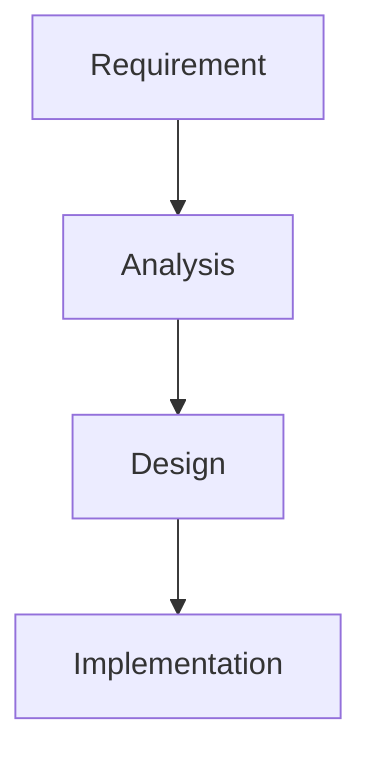

# RFP Builder

Enterprise RFP (Request for Proposal) response generator powered by Microsoft Agent Framework workflows and AI.

## Features

- **AI-Powered Analysis**: Automatically extracts requirements from RFP documents
- **Style Learning**: Uses example RFPs to match your organization's proposal style
- **Structured Output**: Generates well-formatted sections with proper hierarchy
- **Mermaid Diagrams**: Supports automatic diagram generation and conversion to PNG
- **PDF Generation**: Creates downloadable PDF responses
- **Optional Authentication**: Toggle MSAL authentication on/off
- **Image Mode**: Send PDFs as images for better format understanding

## Architecture

```
RFP-BUILDER/
├── backend/                 # FastAPI backend
│   ├── app/
│   │   ├── api/            # API routes
│   │   ├── core/           # Configuration, LLM client
│   │   ├── functions/      # Function calling definitions
│   │   ├── models/         # Pydantic schemas
│   │   ├── prompts/        # System and user prompts
│   │   ├── services/       # PDF, diagram services
│   │   └── workflows/      # Agent Framework workflows
│   └── pyproject.toml
├── frontend/               # React frontend
│   ├── src/
│   │   ├── components/    # React components
│   │   ├── context/       # Auth context
│   │   ├── services/      # API client
│   │   └── types/         # TypeScript types
│   └── package.json
├── config.toml            # Your configuration (git-ignored)
├── config.toml.example    # Example configuration
└── README.md
```

## Quick Start

### Prerequisites

- Python 3.10+
- Node.js 18+
- Azure CLI (if using Azure OpenAI)
- Mermaid CLI (optional, for diagrams): `npm install -g @mermaid-js/mermaid-cli`
- Poppler (for PDF to image conversion): 
  - Windows: Download from https://github.com/oschwartz10612/poppler-windows/releases
  - Mac: `brew install poppler`
  - Linux: `apt-get install poppler-utils`

### Configuration

1. Copy the example config:
```bash
cp config.toml.example config.toml
```

2. Edit `config.toml` with your settings:
```toml
[azure]
endpoint = "https://your-resource.openai.azure.com/"
model = "gpt-4o"

[features]
enable_images = true   # Convert PDFs to images for LLM
enable_auth = false    # Toggle MSAL authentication
```

### Backend Setup

```bash
cd backend

# Create virtual environment
python -m venv venv
source venv/bin/activate  # or `venv\Scripts\activate` on Windows

# Install dependencies
pip install -e .

# Run the server
uvicorn app.main:app --reload
```

The API will be available at http://localhost:8000

### Frontend Setup

```bash
cd frontend

# Install dependencies
npm install

# Run the dev server
npm run dev
```

The frontend will be available at http://localhost:3000

## API Endpoints

### Generate RFP Response

```
POST /api/rfp/generate
Content-Type: multipart/form-data

Parameters:
- rfp: PDF file (required) - The RFP to respond to
- example_rfps: PDF files (required) - Example RFP responses for style reference
- company_context: PDF files (optional) - Company capability documents
```

### Health Check

```
GET /health
```

### Configuration

```
GET /api/config
```

Returns frontend configuration including auth settings.

## Workflow Stages

The RFP Builder uses a sequential workflow with these stages:

1. **Analyze**: Extract requirements, evaluation criteria, and submission guidelines
2. **Generate**: Create proposal sections using function calling for structured output
3. **Review**: Check quality, compliance, and identify improvements
4. **Finalize**: Incorporate feedback and polish the response

## Configuration Options

### Azure OpenAI (Recommended)

```toml
[azure]
endpoint = "https://your-resource.openai.azure.com/"
model = "gpt-4o"
api_version = "2024-02-15-preview"
```

Uses `DefaultAzureCredential` for authentication - ensure you're logged in via Azure CLI.

### Direct OpenAI

```toml
[openai]
api_key = "sk-..."
model = "gpt-4o"
```

### Authentication

```toml
[features]
enable_auth = true

[msal]
client_id = "your-app-registration-client-id"
tenant_id = "your-tenant-id"
redirect_uri = "http://localhost:3000"
scopes = ["User.Read"]
```

### PDF Output

```toml
[pdf_output]
page_size = "letter"    # or "a4"
margin_top = 72         # points
font_family = "Helvetica"
font_size_body = 11
font_size_h1 = 24
```

## Function Calling Schema

The LLM uses structured function calling to generate consistent output:

```json
{
  "name": "generate_rfp_response",
  "parameters": {
    "sections": [
      {
        "section_title": "Executive Summary",
        "section_content": "...",
        "section_type": "h1"
      }
    ]
  }
}
```

Section types: `h1`, `h2`, `h3`, `body`

## Mermaid Diagrams

The LLM can include Mermaid diagrams in responses:

```markdown

```

These are automatically converted to PNG images for the PDF output.

## Development

### Running Tests

```bash
cd backend
pytest
```

### Code Formatting

```bash
# Backend
cd backend
black .
ruff check .

# Frontend
cd frontend
npm run lint
```

## License

MIT
